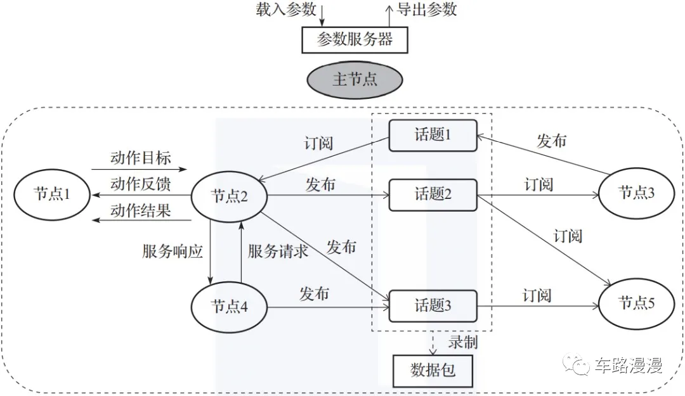
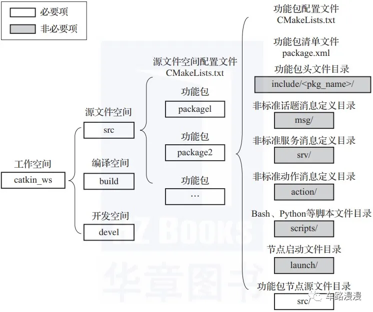

# ros系统架构 
## 名词解释
### 耦合
描述相互依赖关系的紧密程度。

### DDS  （Data Distribution Service）
一种**以数据为中心**的通信模型,类似订阅杂志。

web:https://mp.weixin.qq.com/s/AoaX3ZsGzqE_HZ9p1h4nXg
## 节点，话题，服务间的通信关系
### 一、第一种通信机制：话题——订阅/发布（Topic—Publish/Subscribe）
一个ROS节点可以针对一个给定的话题发布具有特定数据类型的消息，这样的ROS节点称为发布者（Publisher）；另一个ROS节点可以订阅此话题，并接收消息，这样的ROS节点称为订阅者（Subscriber）。

发布者和订阅者并不了解彼此的存在，系统中可能同时有多个节点发布/订阅同一个话题的消息。

一个ROS节点可以是发布者，也可以是订阅者，还可以同时是发布者和订阅者。

### 二、第二种通信机制：服务——请求/响应（Service—Request/Response）
服务一般分为服务器端(Server)和客户端(Client)两个部分。客户端节点发送请求(Request)给服务器节点，并等待回应。服务器端节点收到请求，处理后给客户端返回应答(Response)。

话题类似**订阅杂志**，服务类似**打电话**。

- 话题：多对多，单向，异步，经常
- 服务：一对一，双向，同步，偶尔，用时有限，如：打开某个传感器，用相机拍照
   
web：https://zhuanlan.zhihu.com/p/805275096

## 从计算图视角理解ROS架构
ROS中可执行程序的基本单位叫 节点 （node），节点之间通过消息机制进行通信，这样就组成了一张网状图，也叫计算图，如下图所示。

节点是可执行程序，通常也叫进程。

ROS功能包中创建的每个可执行程序在被启动加载到系统进程中后，就是一个ROS节点，如上图中的节点1、节点2、节点3等。

节点之间通过收发消息进行通信，消息收发机制分为 话题 （topic）、 服务 （service）和 动作 （action）三种，如图1-3中的节点2与节点3、节点2与节点5采用话题通信，节点2与节点4采用服务通信，节点1与节点2采用动作通信。计算图中的节点、话题、服务、动作都要有唯一名称作为标识。

ROS利用节点将代码和功能解耦，提高了系统的容错性和可维护性。所以最好让每个节点都具有特定的单一功能，而不是创建一个包罗万象的庞大节点。如果用C++编写节点，需要用到ROS提供的roscpp库；如果用Python编写节点，需要用到ROS提供的rospy库。

主节点负责各个节点之间通信过程的调度管理。因此主节点必须要最先启动，可以通过roscore命令启动。

消息是构成计算图的关键，包括消息机制和消息类型两部分：消息机制有话题、服务和动作三种，每种消息机制中传递的数据都具有特定的数据类型（即消息类型）；消息类型可分为话题消息类型、服务消息类型和动作消息类型；

数据包 （rosbag）是ROS中专门用来保存和回放话题中数据的文件，可以将一些难以收集的传感器数据用数据包录制下来，然后反复回放来进行算法性能调试。

参数服务器能够为整个ROS网络中的节点提供便于修改的参数。参数可以认为是节点中可供外部修改的全局变量，有静态参数和动态参数。静态参数一般用于在节点启动时设置节点工作模式；动态参数可以用于在节点运行时动态配置节点或改变节点工作状态，比如电机控制节点里的PID控制参数。

web：https://mp.weixin.qq.com/s/ND6PExJC-wemkNTr7OX9yQ

## 从文件系统视角理解ROS架构
ROS程序的不同组件要放在不同的文件夹中，这些文件夹根据不同的功能对文件进行组织，这就是ROS的文件系统结构，如下图所示。

工作空间是一个包含功能包、编译包和编译后可执行文件的文件夹，用户可以根据自己的需要创建多个工作空间，在每个工作空间中开发不同用途的功能包。在上图中，我们创建了一个名为catkin_ws的工作空间，其中包含src、build和devel三个文件夹。
- src文件夹 放置各个功能包和配置功能包的CMake配置文件CMakeLists.txt。这里说明一下，由于ROS中的源码采用catkin工具进行编译，而catkin工具又基于CMake技术，所以我们在src源文件空间和各个功能包中都会见到一个CMake配置文件CMakeLists.txt，这个文件起到配置编译的作用。
- build文件夹 放置编译CMake和catkin功能包时产生的缓存、配置、中间文件等。
- devel文件夹 放置编译好的可执行程序，这些可执行程序是不需要安装就能直接运行的。一旦功能包源码编译和测试通过后，可以将这些编译好的可执行文件直接导出与其他开发人员分享。  

功能包是ROS中软件组织的基本形式，具有创建ROS程序的最小结构和最少内容，它包含ROS节点源码、脚本、配置文件等。

1. CMakeLists.txt是功能包配置文件，用于编译Cmake功能包编译时的编译配置。
2. package.xml是功能包清单文件，用xml的标签格式标记该功能包的各类相关信息，比如包的名称、开发者信息、依赖关系等，主要是为了使功能包的安装和分发更容易。
3. include/\<pkg_name\>是功能包头文件目录，可以把功能包程序中包含的*.h头文件放在这里。include目录之所以还要加一级路径\<pkg_name\>是为了更好地区分自己定义的头文件和系统标准头文件，<pkg_name>用实际功能包的名称替代。不过这个文件夹不是必要项，比如有些程序没有头文件。
4. msg、srv和action这三个文件夹分别用于存放非标准话题消息、服务消息和动作消息的定义文件。ROS支持用户自定义消息通信过程中使用的消息类型。这些自定义消息不是必要的，比如程序只使用标准消息类型。
5. scripts目录存放Bash、Python等脚本文件，为非必要项。
6. launch目录存放节点的启动文件，*.launch文件用于启动一个或多个节点，在含有多个节点的大型项目中很有用，为非必要项。
7. src目录存放功能包节点所对应的源代码，一个功能包中可以有多个节点程序来完成不同的功能，每个节点程序都可以单独运行。这里src目录存放的是这些节点程序的源代码，你可以按需创建文件夹和文件来组织源代码，源代码可以用C++、Python等编写。

web:https://mp.weixin.qq.com/s/ND6PExJC-wemkNTr7OX9yQ

AI对耦合的详细描述  
>在软件工程和系统设计中，“耦合”是指不同模块或组件之间的相互依赖关系的紧密程度。以下是耦合的详细解释：  
耦合的类型：  
紧密耦合（Tight Coupling）：  
当两个或多个模块之间高度依赖，其中一个模块的变更可能需要其他模块也进行相应的变更时，我们说这些模块是紧密耦合的。
紧密耦合的系统难以维护和扩展，因为一个小变化可能会引发一系列的连锁反应。  
松散耦合（Loose Coupling）：  
当模块之间的依赖关系较少，每个模块可以独立于其他模块进行修改和替换时，我们说这些模块是松散耦合的。
松散耦合的系统更容易维护和扩展，因为模块之间的影响较小。  
耦合的例子：  
代码层面的耦合：如果两个类直接依赖于对方的具体实现，而不是通过接口或抽象类进行交互，这就形成了紧密耦合。
系统层面的耦合：如果两个子系统之间有很多直接的数据交换和依赖，而不是通过标准化的消息传递或服务调用进行交互，这也表示紧密耦合。  
耦合的影响：  
可维护性：松散耦合的系统更容易维护，因为更改一个模块不太可能影响其他模块。
可测试性：松散耦合的模块更容易单独测试，因为它们不需要依赖其他模块。
可复用性：松散耦合的模块更易于在其他系统中复用，因为它们对特定环境的依赖较少。
灵活性：松散耦合的系统更加灵活，可以更容易地适应变化和需求。  
在设计和实现软件系统时，开发者通常追求降低耦合度，以提高系统的整体质量和可维护性。通过采用设计原则和模式，如依赖注入、事件驱动、接口隔离等，可以有效地减少耦合。

